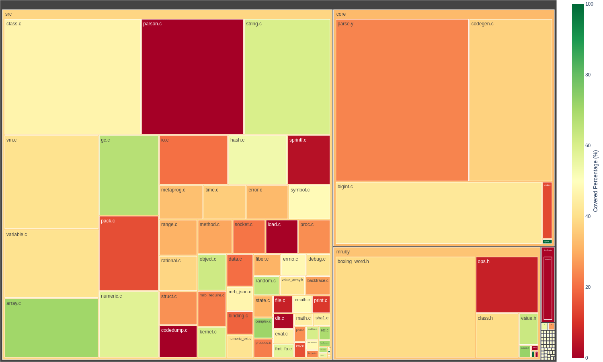
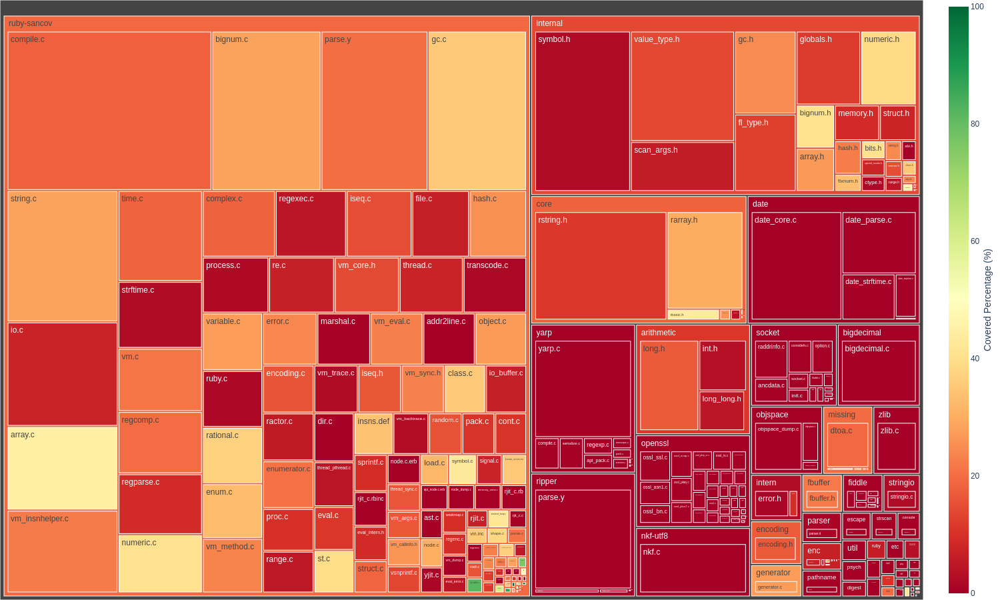
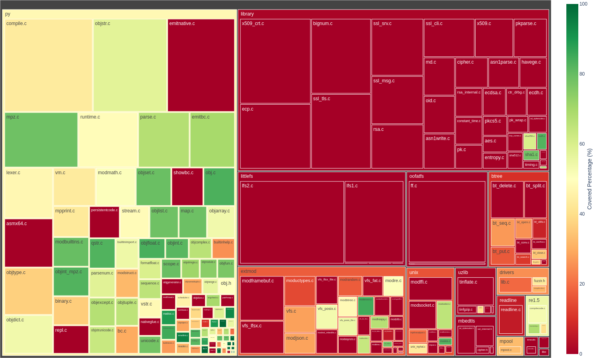
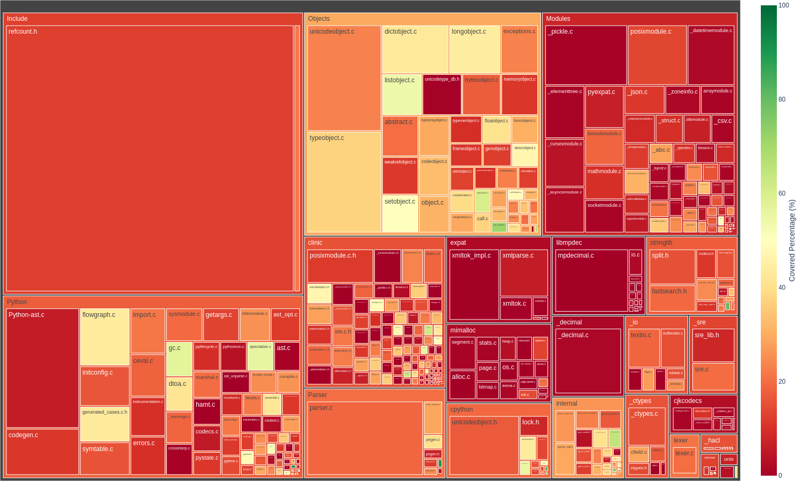
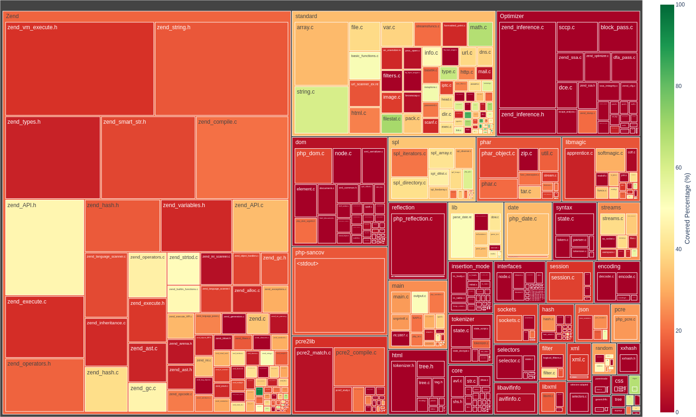
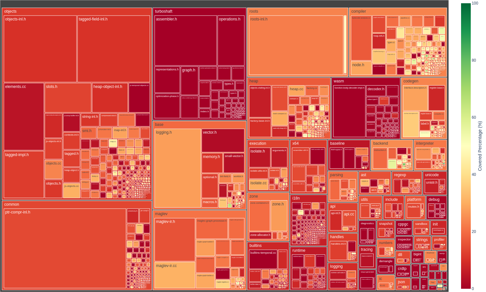

# Reflecta
This repo holds the artifact for [REFLECTA: Reflection-based Scalable and Semantic Scripting Language Fuzzing](https://nebelwelt.net/files/25AsiaCCS.pdf), published in AsiaCCS 2025.

## Reproducing
### Setup

```sh
git clone https://github.com/HexHive/Reflecta
docker pull chibinz/reflecta:latest
```

### Running fuzzing campaigns
To facilitate the launching of fuzzing campaigns for multiple fuzzer-target pairs, we provide the launch.fish script. This script requires three arguments: the first two are comma-delimited lists of fuzzers and targets, respectively, without spaces after commas, and the third is an optional argument indicating the number of repetitions, which defaults to 1. The script automatically detects and binds containers to free CPU cores. For optimal performance, we recommend disabling hyperthreads and using only physical cores. Before running the command, ensure you are in the directory containing `launch.fish`.

```sh
cd Reflecta
scripts/launch.sh reflecta,nautilus,polyglot mruby,cpython,v8 1
```

Supported fuzzers include reflecta, nautilus, polyglot, fuzzilli, and supported targets are ruby, mruby, cpython, micropython, php, v8. By default, campaigns last 23 hours, and the fuzzer output for each fuzzer-target pair is saved in the `./bench/` folder (automatically mounted into each docker container by `launch.fish`).

For running ablated reflecta variant Reflecta-Sem, comment out the reflection mutator in `main.swift`. For Reflecta+Ext, use `JavaScriptEnvironment` (provided by original fuzzilli) instead of `ReflectionEnvironment` (implemented by reflecta).

### Collecting Results
To collect the coverage, we replay the corpus of each fuzzer on a separately built SanitizerCoverage binary. To obtain the correctness rate for Reflecta, lookup `stats/*.json` in Reflecta's outputs in the bench folder. The bugs for each fuzzer are located in the `crashes` folder within each fuzzer's output directory. Coverage results and plots are saved in the `cov` folder of each fuzzer output. This process is automated by our scripts. To perform this analysis, run the following commands inside the Docker container's shell:

```sh
docker run -w /workspaces/FuzzIR -v $PWD/bench:/workspaces/FuzzIR/bench -it reflecta:latest /usr/bin/fish
scripts/collect.fish coverage
```

### Specifications for Nautilus and Polyglot
The grammars we provided for nautilus and polyglot can be found at `targets/{nautilus,polyglot}/grammars`. We use existing grammars provided by the authors if available, otherwise adapting them from the `https://github.com/antlr/grammars-v4` following nautilus and polyglot's instructions, (mostly adding some builtin names and preambles)
Note that the syntax of Python is not context-free due to the indentation rule.This can be resolved at the lexical stage by introducing two special tokens: INDENT and DEDENT, which act similarly to curly braces that enclose the indented block. We modify the Python grammar (for Nautilus and Polyglot) to produce INDENT and DEDENT verbatim in the generated code and then augment our fuzzing driver to replace these two tokens with the correct indentation before passing to the interpreter for execution. For Polyglot+Corpus, we use the corpuse at [OMH4ck/Polyglot-Grammar](https://github.com/OMH4ck/PolyGlot-Grammar/tree/main/php/corpus)


## Developing / Building from scratch
We provide a Dockerfile for automating dependencies setup. VSCode should automatically detect the presence of `.devcontainer/` folder and automatically shows a pop up, prompting you to build and a launch container. If you're using a different editor, you can `docker build` the image and mount the workspace folder accordingly. Scripts for building targets or fuzzers can be found at `scripts/build.fish`. The persistent fuzz drivers source can be found at `drivers/`. For example, if you want to build `polyglot` fuzzer, run `scripts/build.fish polyglot-fuzzer`. If you want build afl instrumented binary for `mruby` (which is used by nautilus), run `scripts/build.fish aflplusplus mruby`. The installed binary together with fuzz driver can be found in the `targets/` directory.

## Coverage treemap of the tested targets
One key insight while developing reflecta was that scripting languages has a very large standard library (or runtime) shipped together with it. Earlier work seems to realize the importance of builtins and standard library functionalies for achieving good coverage, but this was not spoken out explicitly :(. When people think of language features, they tend to think of syntactic or control flow features such as (yield generators, with statements, async functions, inheritance). While important, the implementation of these constructs in terms of lines of C code is smaller compared to functionalities implemented in the standard library. A great to way to visualize this is using a coverage treemap. The block size in the treemap denotes the number of edges instrumented by Sancov in each file / function, and the color indicates the percentage of covered edges (green means a majority is covered). The script for plotting the treemap can be found at `scripts/plot.py`. Note the treemap has three hierarchies: directory, file, and function. The script also outputs an html file which allows you click on each tile and see the coverage percentage for each function. You can also compare the coverage differential of two fuzzers, as shown in paper.

- MRuby



- Ruby



- Micropython



- CPython



- PHP



- V8



## Bugs Found by Reflecta
- MRuby

| Bug type         | Location function      | Status    | Report link                                | Report date | Fix link                                                                       | Fix date   | Comment                                                               |
| :--------------- | :--------------------- | :-------- | :----------------------------------------- | :---------- | :----------------------------------------------------------------------------- | :--------- | :-------------------------------------------------------------------- |
| null-dereference | io_buf_fill            | Confirmed | https://github.com/mruby/mruby/issues/6049 | 15,09.2023  | -                                                                              | -          | Already fixed in the upstream.                                        |
| stack-overflow   | mrb_json_generate      | Fixed     | https://github.com/mruby/mruby/issues/6050 | 15,09.2023  | -                                                                              | -          | Already fixed in the upstream.                                        |
| null-dereference | mrb_addrinfo_unix_path | Fixed     | https://github.com/mruby/mruby/issues/6051 | 16.09.2023  | https://github.com/mruby/mruby/commit/8afb73f3e2a0eac8e064a5f83f5ca1a8e6a29b39 | 19.09.2023 | While handling the Addrinfo class.                                    |
| null-dereference | mrb_vm_exec            | Fixed     | https://github.com/mruby/mruby/issues/6052 | 16.09.2023  | https://github.com/mruby/mruby/commit/75e8a726497813af1fd2c11f1cd8560abf0b8900 | 19.09.2023 | While handling the Proc class.                                        |
| null-dereference | eval_under             | Fixed     | https://github.com/mruby/mruby/issues/6065 | 25.09.2023  | https://github.com/mruby/mruby/commit/d298da8e72d930ed63d2d68c1c21b12d36e1348d | 28.09.2023 | Suspected same root cause to #4.                                      |
| null-dereference | mrb_struct_to_h        | Fixed     | https://github.com/mruby/mruby/issues/6066 | 25.09.2023  | https://github.com/mruby/mruby/commit/0ac917e2285e36391a142ab4adab9f6a71775316 | 28.09.2023 | While handling Struct.new().                                          |
| use-after-free   | ary_rotate_bang        | Fixed     | -                                          | 25.09.2023  | https://github.com/mruby/mruby/commit/a80f394d971834c4ea9380a49ebd218c00dbd257 | 27.09.2023 | While operating on an object treated with rotate!().                  |
| use-after-free   | ary_compact_bang       | Fixed     | -                                          | 25.09.2023  | https://github.com/mruby/mruby/commit/a80f394d971834c4ea9380a49ebd218c00dbd257 | 27.09.2023 | While operating on an object treated with compact!(). Same fix to #7. |


- MicroPython

| Bug type               | Location function             | Status    | Report link                                             | Report date | Fix link                                                                                               | Fix date   | Comment                                                                                     |
| :--------------------- | :---------------------------- | :-------- | :------------------------------------------------------ | :---------- | :----------------------------------------------------------------------------------------------------- | :--------- | :------------------------------------------------------------------------------------------ |
| null-dereference       | mp_reader_new_file            | Confirmed | https://github.com/micropython/micropython/issues/12522 | 26.09.2023  | https://github.com/micropython/micropython/pull/12526                                                  | 27.09.2023 | While handling builtins.execfile().                                                         |
| negative-size-param    | mpz_as_bytes                  | Confirmed | https://github.com/micropython/micropython/issues/12528 | 27.09.2023  | -                                                                                                      | -          | Feeding a wrong-typed "byteorder" parameter to to_bytes().                                  |
| generic                | -                             | Confirmed | https://github.com/micropython/micropython/issues/12531 | 27.09.2023  | https://github.com/micropython/micropython/pull/12535                                                  | 28.09.2023 | MemorySanitizer compatibility issue. Not a crash by fuzzer.                                 |
| global-buffer-overflow | mp_get_stream_raise           | Confirmed | https://github.com/micropython/micropython/issues/12532 | 27.09.2023  |                                                                                                        | -          | Using the return value of "os.VfsPosix()".                                                  |
| heap-use-after-free    | __bt_*                        | Confirmed | https://github.com/micropython/micropython/issues/12543 | 28.09.2023  | -                                                                                                      | -          | Reusing a closed btree object.                                                              |
| null-dereference       | {mvlsb,rgb565}_fill_rect      | Confirmed | https://github.com/micropython/micropython/issues/12562 | 02.10.2023  | https://github.com/micropython/micropython/pull/12585/commits/c57dc8b418e7a200ececf1df217cdcfae2dd5a78 | 04.10.2023 | Feeding an improper fill value to a FrameBuffer instance.                                   |
| null-dereference       | {mvlsb,rgb565}_getpixel       | Fixed     | https://github.com/micropython/micropython/issues/12562 | 02.10.2023  | https://github.com/micropython/micropython/pull/12585/commits/c57dc8b418e7a200ececf1df217cdcfae2dd5a78 | 04.10.2023 | Reported together with #6. (Same fix)                                                       |
| null-dereference       | stringio_write                | Fixed     | https://github.com/micropython/micropython/issues/12563 | 02.10.2023  | https://github.com/micropython/micropython/pull/12585/commits/c57dc8b418e7a200ececf1df217cdcfae2dd5a78 | 04.10.2023 | Involving framebuf.FrameBuffer1(). Some PoCs crash at different functions. (Same fix as #6) |
| null-dereference       | mp_obj_bytes_hex              | Fixed     | https://github.com/micropython/micropython/issues/12563 | 02.10.2023  | https://github.com/micropython/micropython/pull/12585/commits/c57dc8b418e7a200ececf1df217cdcfae2dd5a78 | 04.10.2023 | Reported together with #8. (Same fix as #6)                                                 |
| null-dereference       | mp_reader_mem_readbyte        | Fixed     | https://github.com/micropython/micropython/issues/12563 | 02.10.2023  | https://github.com/micropython/micropython/pull/12585/commits/c57dc8b418e7a200ececf1df217cdcfae2dd5a78 | 04.10.2023 | Reported together with #8. (Same fix as #6)                                                 |
| global-buffer-overflow | mp_vfs_umount                 | Fixed     | https://github.com/micropython/micropython/issues/12587 | 04.10.2023  | -                                                                                                      | -          | While unmounting a bogus path.                                                              |
| heap-buffer-overflow   | mp_seq_multiply               | Fixed     | https://github.com/micropython/micropython/issues/12605 | 06.10.2023  | -                                                                                                      | -          | While operating on a namedtuple object.                                                     |
| null-dereference       | mp_obj_equal_not_equal        | Fixed     | https://github.com/micropython/micropython/issues/12605 | 06.10.2023  | -                                                                                                      | -          | Reported together with #12. Turned out unrelated to 'namedtuple.'                           |
| heap-buffer-overflow   | mpz_hash                      | Fixed     | https://github.com/micropython/micropython/issues/12660 | 11.10.2023  | https://github.com/micropython/micropython/pull/12669                                                  | 12.10.2023 | Using a module as an argument to "uctypes.struct()"                                         |
| null-dereference       | mpz_hash                      | Fixed     | https://github.com/micropython/micropython/issues/12660 | 11.10.2023  | https://github.com/micropython/micropython/pull/12669                                                  | 12.10.2023 | Using a value as an argument to "uctypes.struct()". Reported together with #14.             |
| segmentation-fault     | vfs_posix_file_ioctl          | Fixed     | https://github.com/micropython/micropython/issues/12670 | 12.10.2023  | -                                                                                                      | -          | While closing stdin/stdout.                                                                 |
| global-buffer-overflow | uctypes_struct_agg_size       | Fixed     | https://github.com/micropython/micropython/issues/12702 | 16.10.2023  | -                                                                                                      | -          | While executing uctypes.sizeof().                                                           |
| null-dereference       | mp_obj_is_dict_or_ordereddict | Fixed     | https://github.com/micropython/micropython/issues/12702 | 16.10.2023  | -                                                                                                      | -          | Reported together with #17.                                                                 |
| segmentation-fault     | decompress_error_text_maybe   | Fixed     | https://github.com/micropython/micropython/issues/12735 | 19.10.2023  | -                                                                                                      | -          | While referencing an Error object, initialized with sys.version.                            |
| global-buffer-overflow | task_push_queue               | Fixed     | https://github.com/micropython/micropython/issues/12776 | 23.10.2023  | -                                                                                                      | -          | While pushing an object to "asyncio.TaskQueue()".                                           |


- PHP

| Bug type         | Location function       | Status | Report link                                                            | Report date | Fix link | Fix date | Comment                                                      |
| :--------------- | :---------------------- | :----- | :--------------------------------------------------------------------- | :---------- | :------- | :------- | :----------------------------------------------------------- |
| null-dereference | zend_hash_clean         | Fixed  | https://github.com/php/php-src/security/advisories/GHSA-hh2m-7xq2-44p3 | 24.11.2023  | -        | -        | Calling "spl_autoload_unregister" with a string parameter.   |
| null-dereference | zif_forward_static_call | Fixed  | https://github.com/php/php-src/security/advisories/GHSA-w3f6-fp6r-7h82 | 24.11.2024  | -        | -        | Calling "register_shutdown_function" with string parameters. |
| null-dereference | zif_func_{num,get}_args | Fixed  | https://github.com/php/php-src/security/advisories/GHSA-c2qc-q2pj-w5p9 | 24.11.2025  | -        | -        | Passing "func_{num,get}_args" to a crashing function.        |
